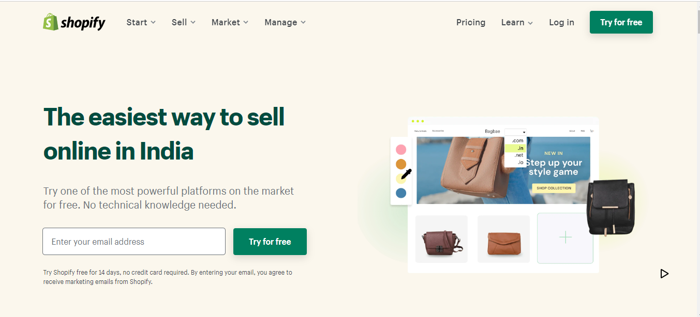
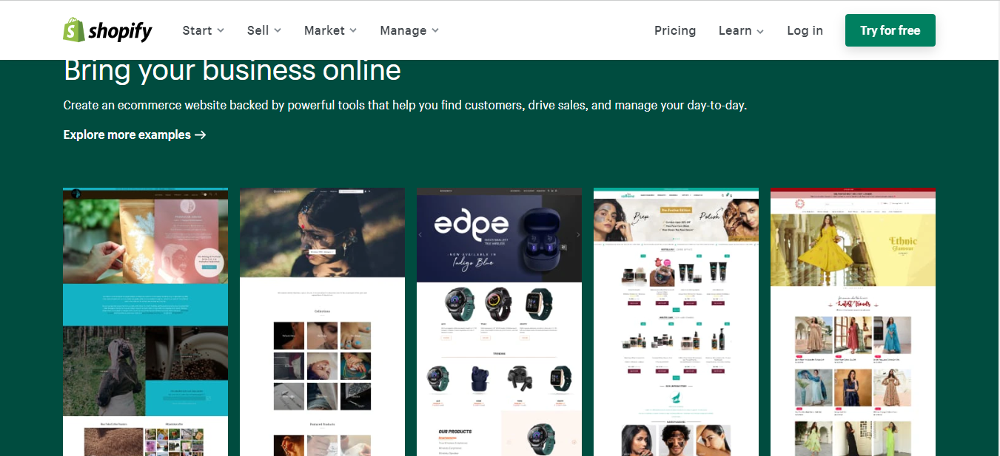
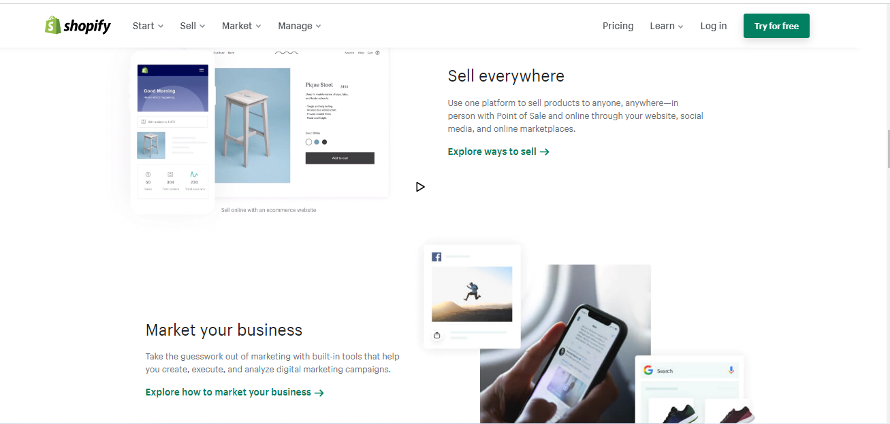

## My Name is Ajay.
## second tailwind project from web dev bootcamp - Ineuron
# [Live website Link](https://aj-shopify-clone.netlify.app/)
#### This project was to build shopify clone from scratch. I learnt how to read different documents and build the website as I did not know much about tailwind css. Had to read the tailwind css docs for various components. I can now build any websites using, HTML, CSS and just Tailwind CSS.Thank you Hitesh Choudhary, for reigniting the fire in me by providing a practical approach to learning web dev.

### Time Taken to complete the prject: 5 hours.

### Website Preview:-

